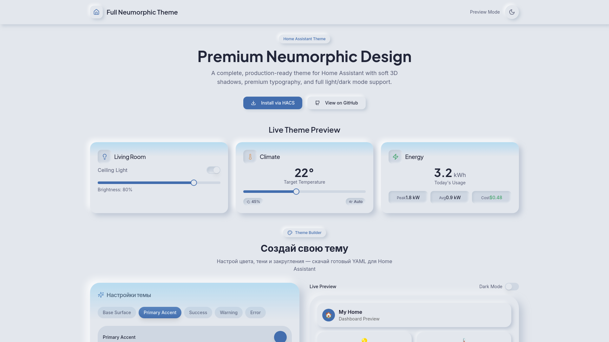
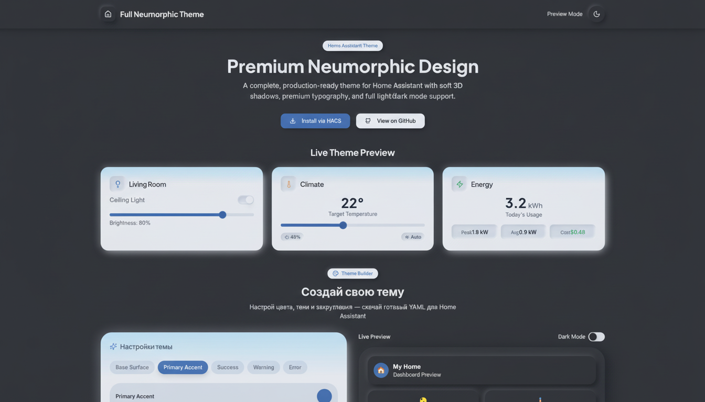

# Neumorphic Bliss (Themesberg Pro EXACT)

> [!IMPORTANT]
> **НОВАЯ ТЕМА: Neumorphism Pro** — это 100% точная копия дизайна Themesberg Neumorphism UI Pro.
> Если HACS показывает только версию **v1.0.0**, при переустановке/обновлении выберите версию **main** в выпадающем списке. Это загрузит самую свежую версию темы.

[](https://github.com/ha-community/ha-neumorphic-cardmod-theme/actions/workflows/validate.yml)
[](https://www.home-assistant.io/)
[](https://hacs.xyz/)
[](LICENSE)
[](https://github.com/ha-community/ha-neumorphic-cardmod-theme/releases)

> 🎨 A premium soft-UI neumorphic theme for Home Assistant with built-in card-mod variables

<p align="center">
  <a href="https://b317b869-7743-413b-bf8d-bc2eda607be4.lovableproject.com" target="_blank">
    
  </a>
</p>

---

## ✨ Features

- **Dual Mode Support** — Light and dark themes with carefully crafted neumorphic shadows
- **True Neumorphism** — Realistic soft-UI with convex, concave, and flat shadow variants
- **Card-Mod Ready** — Built-in CSS custom properties for easy card-mod styling
- **Full Coverage** — Styles for cards, sidebar, header, inputs, toggles, sliders, and more
- **Mushroom Compatible** — Works perfectly with Mushroom cards and chips
- **16px Border Radius** — Consistent, modern UI rhythm throughout

---

## 🎨 Available Themes

This repository now includes **three themes**:

| Theme | Description | Best For |
|-------|-------------|----------|
| **Neumorphic** | Original soft-UI theme | General use, Mushroom cards |
| **Full Neumorphic** | Extended variables | Advanced card-mod users |
| **Neumorphism Pro** ⭐ | **Exact Themesberg reference** | Production-ready, exact color match |

### 🆕 Neumorphism Pro (New!)

**Perfect replica of [Themesberg Neumorphism UI Pro](https://demo.themesberg.com/neumorphism-ui-pro/)**

- ✅ **Exact colors**: `#e6e7ee` base, `#b8b9be` / `#ffffff` shadows
- ✅ **90+ HA variables** - complete coverage
- ✅ **Light & Dark modes**
- ✅ **Production-ready**

**Installation:**
1. Download [`themes/neumorphism_pro.yaml`](themes/neumorphism_pro.yaml)
2. Copy to `/config/themes/` in Home Assistant
3. Restart Home Assistant
4. Select **"Neumorphism Pro"** in Profile → Theme

---

## 📸 Screenshots

<table>
  <tr>
    <td align="center"><strong>Light Mode</strong></td>
    <td align="center"><strong>Dark Mode</strong></td>
  </tr>
  <tr>
    <td></td>
    <td></td>
  </tr>
</table>

<p align="center">
  
</p>

---

## 📋 Requirements

| Component | Required | Notes |
|-----------|----------|-------|
| Home Assistant | 2023.1+ | Core requirement |
| [HACS](https://hacs.xyz/) | Recommended | For easy installation |
| [card-mod](https://github.com/thomasloven/lovelace-card-mod) | Optional | For advanced neumorphic effects |

---

## 🚀 Installation

### Option A: HACS (Recommended)

1. Open HACS in your Home Assistant
2. Click the three dots menu (⋮) → **Custom repositories**
3. Add repository URL:
   ```
   https://github.com/ha-community/ha-neumorphic-cardmod-theme
   ```
4. Select category: **Theme**
5. Click **Add**
6. Find "Neumorphic Card-Mod Theme" and click **Download**
7. Restart Home Assistant

### Option B: Manual Installation

1. Download the theme you want:
   - [`themes/neumorphic.yaml`](themes/neumorphic.yaml) - Original theme
   - [`themes/full_neumorphic.yaml`](themes/full_neumorphic.yaml) - Extended variables
   - [`themes/neumorphism_pro.yaml`](themes/neumorphism_pro.yaml) ⭐ **NEW** - Exact Themesberg colors
2. Copy to your Home Assistant `/config/themes/` folder
3. Ensure your `configuration.yaml` includes:
   ```yaml
   frontend:
     themes: !include_dir_merge_named themes
   ```
4. Restart Home Assistant

> **💡 Tip**: You can install multiple themes and switch between them!

---

## 🎨 Applying the Theme

### Per User

1. Go to **Settings** → **Profile** (your user profile)
2. Under **Theme**, select **Neumorphic**

### System Default

Add to your `configuration.yaml`:

```yaml
frontend:
  themes: !include_dir_merge_named themes

homeassistant:
  customize: !include customize.yaml
  # Set default theme
automation:
  - alias: "Set Default Theme"
    trigger:
      - platform: homeassistant
        event: start
    action:
      - service: frontend.set_theme
        data:
          name: Neumorphic
```

---

## 🔧 Card-Mod Integration (Optional)

This theme includes custom CSS variables specifically designed for card-mod. Install [card-mod](https://github.com/thomasloven/lovelace-card-mod) to unlock advanced neumorphic effects.

### Available CSS Variables

| Variable | Description |
|----------|-------------|
| `--neumorphic-convex-shadow-sm` | Small raised shadow |
| `--neumorphic-convex-shadow-md` | Medium raised shadow |
| `--neumorphic-convex-shadow-lg` | Large raised shadow |
| `--neumorphic-concave-shadow-sm` | Small pressed/inset shadow |
| `--neumorphic-concave-shadow-md` | Medium pressed/inset shadow |
| `--neumorphic-concave-shadow-lg` | Large pressed/inset shadow |
| `--neumorphic-flat-shadow` | Subtle flat shadow |
| `--neumorphic-hover-shadow` | Enhanced shadow for hover states |
| `--neumorphic-active-shadow` | Pressed state shadow |
| `--neumorphic-surface` | Base surface color |
| `--neumorphic-surface-alt` | Alternate surface color |

---

## 📝 Card-Mod Examples

### Global Dashboard Styling

Apply neumorphic styling to all cards on a dashboard:

```yaml
# In your dashboard YAML (raw configuration)
views:
  - title: Home
    path: home
    card_mod:
      style: |
        ha-card {
          background: var(--neumorphic-surface) !important;
          box-shadow: var(--neumorphic-convex-shadow-lg) !important;
          border: none !important;
        }
    cards:
      - type: weather-forecast
        entity: weather.home
```

### Single Card Styling

#### Tile Card

```yaml
type: tile
entity: light.living_room
card_mod:
  style: |
    ha-card {
      background: var(--neumorphic-surface);
      box-shadow: var(--neumorphic-convex-shadow-md);
      border: none;
      transition: all 0.2s ease;
    }
    ha-card:active {
      box-shadow: var(--neumorphic-active-shadow);
    }
```

#### Mushroom Card

```yaml
type: custom:mushroom-light-card
entity: light.bedroom
card_mod:
  style: |
    ha-card {
      background: var(--neumorphic-surface) !important;
      box-shadow: var(--neumorphic-convex-shadow-lg) !important;
      border: none !important;
    }
```

#### Mushroom Chips

```yaml
type: custom:mushroom-chips-card
chips:
  - type: entity
    entity: sensor.temperature
card_mod:
  style: |
    ha-card {
      background: transparent !important;
      box-shadow: none !important;
    }
    mushroom-chip {
      background: var(--neumorphic-surface) !important;
      box-shadow: var(--neumorphic-convex-shadow-sm) !important;
      border: none !important;
    }
```

### Toggle / Switch

```yaml
type: entities
entities:
  - entity: switch.lamp
card_mod:
  style:
    ha-switch $: |
      .mdc-switch__track {
        background: var(--neumorphic-surface-alt) !important;
        box-shadow: var(--neumorphic-concave-shadow-sm) !important;
      }
      .mdc-switch__handle {
        background: var(--neumorphic-surface) !important;
        box-shadow: var(--neumorphic-convex-shadow-sm) !important;
      }
```

### Slider

```yaml
type: entities
entities:
  - entity: input_number.volume
card_mod:
  style:
    ha-slider $: |
      .container {
        background: var(--neumorphic-surface-alt);
        box-shadow: var(--neumorphic-concave-shadow-sm);
        border-radius: 10px;
        height: 8px;
      }
      .knob {
        background: var(--neumorphic-surface);
        box-shadow: var(--neumorphic-convex-shadow-sm);
      }
```

### Input Field

```yaml
type: entities
entities:
  - entity: input_text.name
card_mod:
  style:
    ha-textfield $: |
      .mdc-text-field {
        background: var(--neumorphic-surface-alt) !important;
        box-shadow: var(--neumorphic-concave-shadow-sm) !important;
        border-radius: 12px !important;
        border: none !important;
      }
```

### Icon Button

```yaml
type: custom:mushroom-template-card
primary: ""
icon: mdi:power
tap_action:
  action: toggle
entity: switch.lamp
card_mod:
  style: |
    ha-card {
      background: var(--neumorphic-surface);
      box-shadow: var(--neumorphic-convex-shadow-md);
      border-radius: 50%;
      aspect-ratio: 1;
      display: flex;
      align-items: center;
      justify-content: center;
      transition: all 0.15s ease;
    }
    ha-card:active {
      box-shadow: var(--neumorphic-active-shadow);
      transform: scale(0.98);
    }
```

### 🔄 Updating via HACS

If you already have this repository added and don't see **Neumorphism Pro**:

1. Open **HACS** in Home Assistant.
2. Go to **Entry** for this repository (`Neumorphic Bliss`).
3. Click the **three dots (⋮)** in the top right.
4. Select **Update information** to force HACS to see the new GitHub changes.
5. If an update is available, click **Update**.
6. If not, click **Redownload**.
7. **IMPORTANT**: Go to **Developer Tools** → **YAML** → Click **THEMES** to reload them without restarting.
8. Refresh your browser page (`Ctrl + F5`).

---

## ⚠️ Known Issues & Tips

### Browser Cache

After installing or updating the theme, clear your browser cache:
- **Windows/Linux:** `Ctrl + Shift + R` or `Ctrl + F5`
- **Mac:** `Cmd + Shift + R`

### Theme Not Appearing

1. Ensure the YAML file is in `/config/themes/`
2. Check `configuration.yaml` includes themes directory
3. Restart Home Assistant (not just reload)

### Conflicts with Other Themes

If you have multiple themes installed and experience visual glitches:
1. Switch to default Home Assistant theme first
2. Clear browser cache
3. Apply Neumorphic theme

### Card-Mod Not Working

1. Ensure card-mod is installed via HACS
2. Add card-mod as a resource in **Settings → Dashboards → Resources**
3. Refresh browser after adding

---

## 🏠 My Home Assistant

[](https://my.home-assistant.io/redirect/hacs_repository/?owner=ha-community&repository=ha-neumorphic-cardmod-theme&category=theme)

> **Note:** Replace the URL above with your actual GitHub repository URL after publishing.

---

## 🎨 Color Palette

### Light Mode

| Element | Color | Hex |
|---------|-------|-----|
| Base Surface |  | `#E4E4E0` |
| Shadow Dark |  | `#c8c8c4` |
| Shadow Light |  | `#ffffff` |
| Primary |  | `#4A6FA5` |
| Text |  | `#2D3142` |

### Dark Mode

| Element | Color | Hex |
|---------|-------|-----|
| Base Surface |  | `#2A2A2E` |
| Shadow Dark |  | `#1e1e21` |
| Shadow Light |  | `#36363b` |
| Primary |  | `#6B9BD2` |
| Text |  | `#E8E4DF` |

---

## 🤝 Contributing

Contributions are welcome! Please read [CONTRIBUTING.md](CONTRIBUTING.md) for guidelines.

---

## 📄 License

This project is licensed under the MIT License - see the [LICENSE](LICENSE) file for details.

---

## 📜 Changelog

See [CHANGELOG.md](CHANGELOG.md) for version history.

---

<p align="center">
  Made with ❤️ for the Home Assistant Community
</p>
